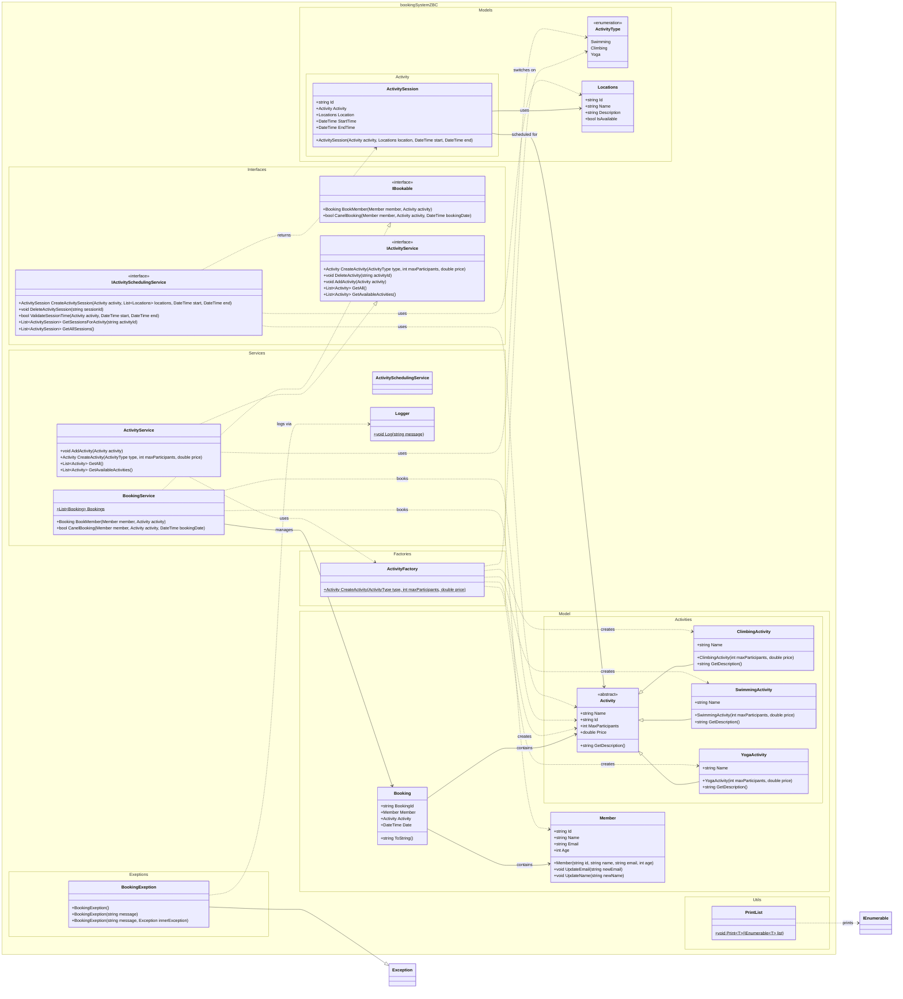

# UML Architecture

Full UML diagram for the current classes, interfaces, and enums in the project.

## How To Read The Architecture

- `Activity` is the base abstraction for all activities.
- `ClimbingActivity`, `SwimmingActivity`, and `YogaActivity` are concrete implementations of `Activity`.
- `ActivityFactory` creates the correct activity based on `ActivityType`.
- `ActivityService` is the service layer for activity operations.
- `BookingService` handles bookings and stores a list of `Booking`.
- `Booking` connects `Member` and `Activity`.
- `ActivitySession` describes an activity held at a specific `Location` and time.
- `IActivityService`, `IBookable`, and `IActivitySchedulingService` are service-layer contracts.

## Notes About The Current Code

- `ActivityService` declares `IActivityService` but currently does not implement `DeleteActivity`.
- `ActivitySchedulingService` is still empty even though `IActivitySchedulingService` already exists.
- In `IActivitySchedulingService.CreateActivitySession(...)`, the parameter is `List<Locations>`, while `ActivitySession` uses a single `Locations`.
- In `Activity.Id`, every property access creates a new `Guid`, so the identifier is not stable for one object instance.
